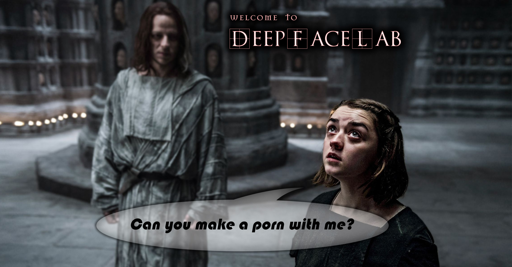

<table align="center"><tr><td align="center" width="9999">

  
# DeepFaceLab  
### the leading software for creating deepfakes

</td></tr>
<tr><td align="center" width="9999">

More than 95% of deepfake videos are created with DeepFaceLab.

DeepFaceLab is used by such popular youtube channels as

| [Ctrl Shift Face](https://www.youtube.com/channel/UCKpH0CKltc73e4wh0_pgL3g)| [Sham00k](https://www.youtube.com/channel/UCZXbWcv7fSZFTAZV4beckyw/videos)| [Collider videos](https://www.youtube.com/watch?v=A91P2qtPT54&list=PLayt6616lBclvOprvrC8qKGCO-mAhPRux)| [iFake](https://www.youtube.com/channel/UCC0lK2Zo2BMXX-k1Ks0r7dg/videos)| [VFXChris Ume](https://www.youtube.com/channel/UCGf4OlX_aTt8DlrgiH3jN3g/videos)|
|---|---|---|---|---|
</td></tr>
<tr><td align="center" width="9999">

# The road so far

</td></tr>
<tr><td align="center" width="9999">

deepfake quality progress

|
first contact
|
nowadays
|
|---|---|
|||
</td></tr>

<tr><td align="center" width="9999">

## Releases

||||
|---|---|---|
|Windows|[Google drive](https://drive.google.com/open?id=1BCFK_L7lPNwMbEQ_kFPqPpDdFEOd_Dci)|if the download quota is exceeded, add the file to your own google drive and download from it|
||[Torrent page](https://rutracker.org/forum/viewtopic.php?t=5558863)|Use bittorrent client.| 
|Google Colab|[github](https://github.com/chervonij/DFL-Colab)|by @chervonij . You can train fakes for free using Google Colab.|
|Linux|[github](https://github.com/lbfs/DeepFaceLab_Linux)|by @lbfs. May be outdated|
||||

</td></tr>

<tr><td align="center" width="9999">

## Links

||||
|---|---|---|
|Guides and tutorials|[mrdeepfakes](https://mrdeepfakes.com/forums/forum-guides-and-tutorials)||
||||
|Ready to work facesets|[mrdeepfakes](https://mrdeepfakes.com/forums/forum-celebrity-facesets)||
||||
|Communication groups|[telegram (English / Russian)](https://t.me/DeepFaceLab_official)|Don't forget to hide your phone number.|
||[telegram (English only)](https://t.me/DeepFaceLab_official_en)|Don't forget to hide your phone number.|
||[mrdeepfakes](https://mrdeepfakes.com/forums/)|the biggest NSFW English community|
||QQ 951138799| Chinese QQ group for ML/AI experts||
||[deepfaker.xyz](https://www.deepfaker.xyz)|Chinesse guys are localizing DeepFaceLab|
||[reddit r/GifFakes/](https://www.reddit.com/r/GifFakes/new/)|Post your deepfakes there !|
||[reddit r/SFWdeepfakes/](https://www.reddit.com/r/SFWdeepfakes/new/)|Post your deepfakes there !|

</td></tr>

<tr><td align="center" width="9999">
  
## How I can help the project?

||||
|---|---|---|
|Donate|If you like this software, please consider a donation. Current **GOAL**: next DeepFaceLab update.||
||[Donate via Paypal](https://www.paypal.com/cgi-bin/webscr?cmd=_donations&business=lepersorium@gmail.com&lc=US&no_note=0&item_name=Support+DeepFaceLab&cn=&curency_code=USD&bn=PP-DonationsBF:btn_donateCC_LG.gif:NonHosted)
||[Donate via Yandex.Money](https://money.yandex.ru/to/41001142318065)||
||bitcoin:31mPd6DxPCzbpCMZk4k1koWAbErSyqkAXr||
||||
|Collect facesets|You can collect faceset of any celebrity that can be used in DeepFaceLab and share it [in the community](https://mrdeepfakes.com/forums/forum-celebrity-facesets)|
</td></tr>

<tr><td align="center" width="9999">
  
## Meme zone

</td></tr>
<tr><td align="center" width="9999">

#deepfacelab #deepfakes #faceswap #face-swap #deep-learning #deeplearning #deep-neural-networks #deepface #deep-face-swap #fakeapp #fake-app #neural-networks #neural-nets

</td></tr>
</table>
