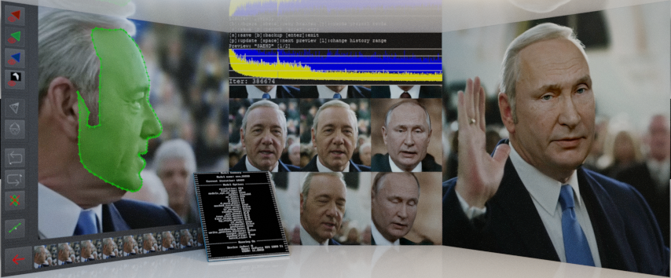
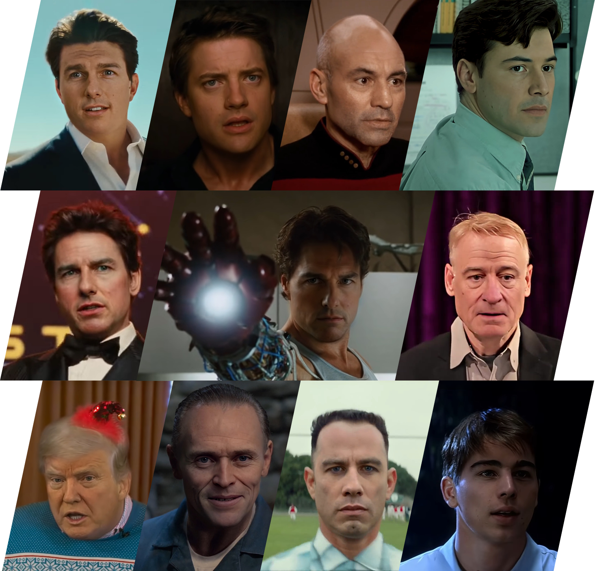
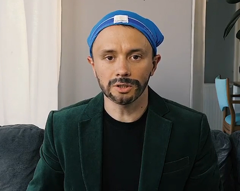
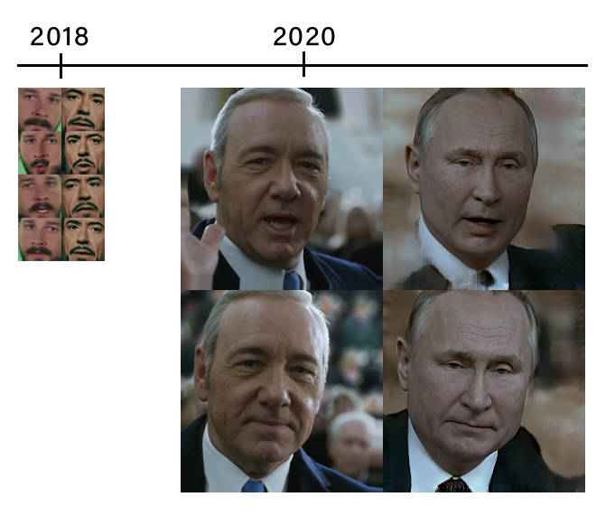
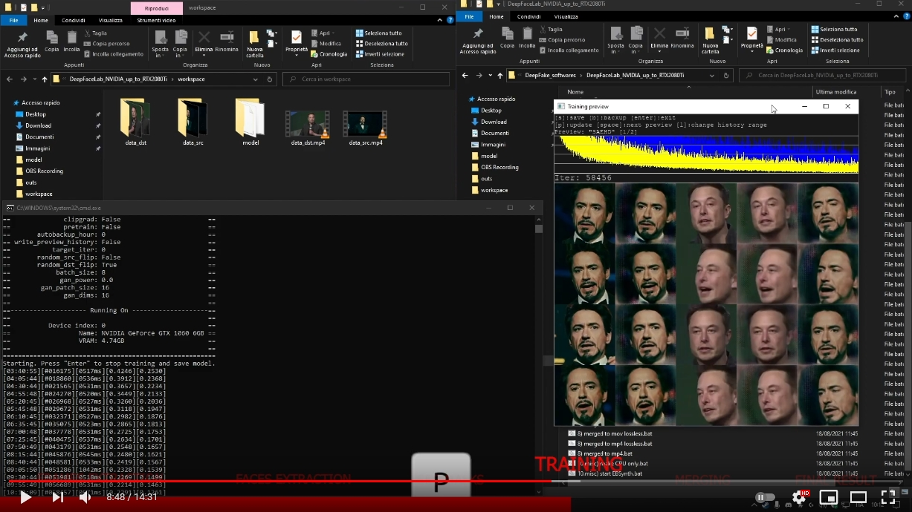
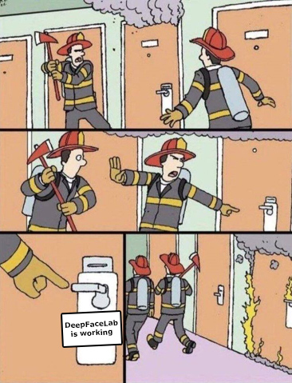
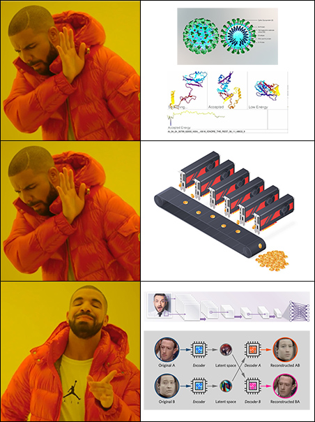

<table align="center" border="0">

<tr><td colspan=2 align="center">

# DeepFaceLab  

<a href="https://arxiv.org/abs/2005.05535">

</img>
https://arxiv.org/abs/2005.05535</a>

### the leading software for creating deepfakes

</td></tr>
<tr><td colspan=2 align="center">

More than 95% of deepfake videos are created with DeepFaceLab.

DeepFaceLab is used by such popular youtube channels as

| [Ctrl Shift Face](https://www.youtube.com/channel/UCKpH0CKltc73e4wh0_pgL3g)| [VFXChris Ume](https://www.youtube.com/channel/UCGf4OlX_aTt8DlrgiH3jN3g/videos)|
|---|---|

| [Sham00k](https://www.youtube.com/channel/UCZXbWcv7fSZFTAZV4beckyw/videos)| [Collider videos](https://www.youtube.com/watch?v=A91P2qtPT54&list=PLayt6616lBclvOprvrC8qKGCO-mAhPRux)| [iFake](https://www.youtube.com/channel/UCC0lK2Zo2BMXX-k1Ks0r7dg/videos)|
|---|---|---|

| [NextFace](https://www.youtube.com/channel/UCFh3gL0a8BS21g-DHvXZEeQ/videos)| [Futuring Machine](https://www.youtube.com/channel/UCC5BbFxqLQgfnWPhprmQLVg)| [RepresentUS](https://www.youtube.com/channel/UCRzgK52MmetD9aG8pDOID3g)|
|---|---|---|

</td></tr>

<tr><td colspan=2 align="center">

# What can I do using DeepFaceLab?

</td></tr>
<tr><td colspan=2 align="center">

## Replace the face

</td></tr>

<tr><td colspan=2 align="center">

## De-age the face

</td></tr>

<tr><td align="center" width="50%">

</td>
<td align="center" width="50%">

</td></tr>

<tr><td colspan=2 align="center">

 https://www.youtube.com/watch?v=Ddx5B-84ebo

</td></tr>

<tr><td colspan=2 align="center">

## Replace the head

</td></tr>

<tr><td align="center" width="50%">

</td>
<td align="center" width="50%">

</td></tr>

<tr><td colspan=2 align="center">

 https://www.youtube.com/watch?v=xr5FHd0AdlQ

</td></tr>

<tr><td align="center" width="50%">

</td>
<td align="center" width="50%">

</td></tr>

<tr><td colspan=2 align="center">

 https://www.youtube.com/watch?v=RTjgkhMugVw

</td></tr>

<tr><td align="center" width="50%">

</td>
<td align="center" width="50%">

</td></tr>

<tr><td colspan=2  align="center">

 https://www.youtube.com/watch?v=R9f7WD0gKPo

</td></tr>

<tr><td colspan=2 align="center">

## Manipulate politicians speech
(requires a skill in video editors such as *Adobe After Effects* or *Davinci Resolve*)

 https://www.youtube.com/watch?v=2Z1oA3GYPaY

 https://www.youtube.com/watch?v=sbFHhpYU15w

 https://www.youtube.com/watch?v=ERQlaJ_czHU

</td></tr>
<tr><td colspan=2 align="center">

# Deepfake native resolution progress

</td></tr>
<tr><td colspan=2 align="center">

</td></tr>
<tr><td colspan=2 align="center">

Unfortunately, there is no "make everything ok" button in DeepFaceLab. You should spend time studying the workflow and growing your skills. A skill in programs such as *AfterEffects* or *Davinci Resolve* is also desirable.

</td></tr>
<tr><td colspan=2 align="center">

## Mini tutorial

</td></tr>
<tr><td colspan=2 align="center">

## Releases

</td></tr>

<tr><td align="right">
<a href="https://tinyurl.com/y6npm2su">Windows (magnet link)</a>
</td><td align="center">Last release. Use torrent client to download.</td></tr>

<tr><td align="right">
<a href="https://mega.nz/folder/Po0nGQrA#dbbttiNWojCt8jzD4xYaPw">Windows (Mega.nz)</a>
</td><td align="center">Contains new and prev releases.</td></tr>

<tr><td align="right">

</td><td align="center">by @chervonij . You can train fakes for free using Google Colab.</td></tr>

<tr><td align="right">
<a href="https://github.com/nagadit/DeepFaceLab_Linux">Linux (github)</a>
</td><td align="center">by @nagadit</td></tr>

<tr><td align="right">
<a href="https://github.com/elemantalcode/dfl">CentOS Linux (github)</a>
</td><td align="center">May be outdated. By @elemantalcode</td></tr>

</table>

<table align="center" border="0">

<tr><td colspan=2 align="center">

## Links

</td></tr>

<tr><td colspan=2 align="center">

### Guides and tutorials

</td></tr>

<tr><td align="right">
<a href="https://mrdeepfakes.com/forums/thread-guide-deepfacelab-2-0-explained-and-tutorials-recommended">DeepFaceLab guide</a>
</td><td align="center">Main guide</td></tr>

<tr><td align="right">
<a href="https://mrdeepfakes.com/forums/thread-guide-celebrity-faceset-dataset-creation-how-to-create-celebrity-facesets">Faceset creation guide</a>
</td><td align="center">How to create the right faceset</td></tr>

<tr><td align="right">

</td><td align="center">Guide how to train the fake on Google Colab</td></tr>

<tr><td align="right">
<a href="https://mrdeepfakes.com/forums/thread-deepfacelab-2-0-compositing-in-davinci-resolve-vegas-pro-and-after-effects">Compositing</a>
</td><td align="center">To achieve the highest quality, compose deepfake manually in video editors such as Davinci Resolve or Adobe AfterEffects</td></tr>

<tr><td align="right">
<a href="https://mrdeepfakes.com/forums/thread-deepfacelab-2-0-discussion-tips-suggestions">Discussion and suggestions</a>
</td><td align="center"></td></tr>

<tr><td colspan=2 align="center">

### Supplementary material

</td></tr>

<tr><td align="right">
<a href="https://mrdeepfakes.com/forums/forum-celebrity-facesets">Ready to work facesets</a>
</td><td align="center">Celebrity facesets made by community</td></tr>

<tr><td align="right">
<a href="https://mrdeepfakes.com/forums/forum-trained-models">Pretrained models</a>
</td><td align="center">Pretrained models made by community</td></tr>

<tr><td colspan=2 align="center">

### Communication groups

</td></tr>

<tr><td align="right">
<a href="https://www.reddit.com/r/RUdeepfakes/new/">reddit r/RUdeepfakes/</a>
</td><td align="center">Постим русские дипфейки сюда !</td></tr>

<tr><td align="right">
<a href="https://mrdeepfakes.com/forums/forum-russian-community">Русское сообщество</a>
</td><td align="center"></td></tr>

<tr><td align="right">
<a href="https://t.me/joinchat/ElkhqlgJ0I5HhdJyFar80w">telegram (English / Русский)</a>
</td><td align="center">Don't forget to hide your phone number</td></tr>

<tr><td align="right">
<a href="https://t.me/joinchat/ElkhqkzB6uqyjCzoXwv3gg">telegram (English only)</a>
</td><td align="center">Don't forget to hide your phone number</td></tr>

<tr><td align="right">
<a href="https://mrdeepfakes.com/forums/">mrdeepfakes</a>
</td><td align="center">the biggest NSFW English community</td></tr>

<tr><td align="right">
<a href="https://www.reddit.com/r/GifFakes/new/">reddit r/GifFakes/</a>
</td><td align="center">Post your deepfakes there !</td></tr>

<tr><td align="right">
<a href="https://www.reddit.com/r/SFWdeepfakes/new/">reddit r/SFWdeepfakes/</a>
</td><td align="center">Post your deepfakes there !</td></tr>

<tr><td align="right">
QQ 951138799
</td><td align="center">中文 Chinese QQ group for ML/AI experts</td></tr>

<tr><td align="right">
<a href="https://www.deepfaker.xyz/">deepfaker.xyz</a>
</td><td align="center">中文学习站（非官方)</td></tr>

</table>

<table align="center" border="0">

<tr><td colspan=2 align="center">

## How I can help the project?

</td></tr>

<tr><td colspan=2 align="center">

### Sponsor deepfake research and DeepFaceLab development.

</td></tr>

<tr><td colspan=2 align="center">
<a href="https://www.paypal.com/cgi-bin/webscr?cmd=_donations&business=lepersorium@gmail.com&lc=US&no_note=0&item_name=Support+DeepFaceLab&cn=&curency_code=USD&bn=PP-DonationsBF:btn_donateCC_LG.gif:NonHosted">Donate via Paypal</a>
</td></tr>

<tr><td colspan=2 align="center">
<a href="https://money.yandex.ru/to/41001142318065">Donate via Yandex.Money</a>
</td></tr>

<tr><td colspan=2 align="center">
bitcoin:bc1qkhh7h0gwwhxgg6h6gpllfgstkd645fefrd5s6z
</td></tr>

<tr><td align="right">
Alipay 捐款
</td><td align="center">  </td></tr>

<tr><td colspan=2 align="center">

### Collect facesets

</td></tr>

<tr><td colspan=2 align="center">

You can collect faceset of any celebrity that can be used in DeepFaceLab and share it <a href="https://mrdeepfakes.com/forums/forum-celebrity-facesets">in the community</a>
</td></tr>

<tr><td colspan=2 align="center">

### Star this repo

</td></tr>

<tr><td colspan=2 align="center">

Register github account and push "Star" button.

</td></tr>

</table>

<table align="center" border="0">
<tr><td colspan=2 align="center">

## Meme zone

</td></tr>

<tr><td align="center" width="50%">

</td>

<td align="center" width="50%">

</td></tr>

<tr><td colspan=2>

</td></tr>

<tr><td colspan=2 align="center">

#deepfacelab #deepfakes #faceswap #face-swap #deep-learning #deeplearning #deep-neural-networks #deepface #deep-face-swap #fakeapp #fake-app #neural-networks #neural-nets #tensorflow #cuda #nvidia

</td></tr>

</table>
