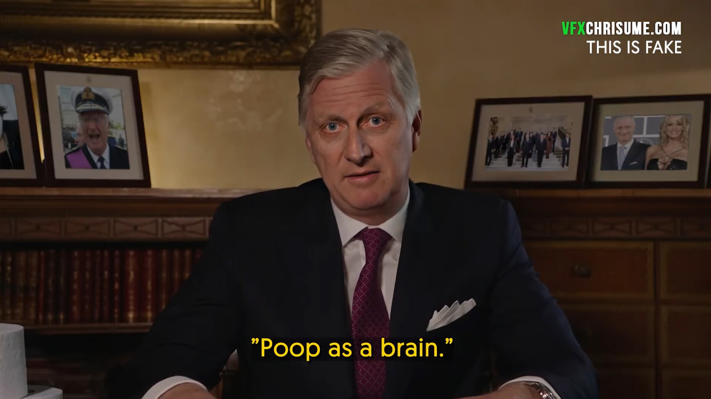

<table align="center" border="0"><tr><td align="center" width="9999">

# DeepFaceLab  

<a href="https://arxiv.org/abs/2005.05535">

</img>
https://arxiv.org/abs/2005.05535</a>

### the leading software for creating deepfakes

</td></tr>
<tr><td align="center" width="9999">

More than 95% of deepfake videos are created with DeepFaceLab.

DeepFaceLab is used by such popular youtube channels as

| [Ctrl Shift Face](https://www.youtube.com/channel/UCKpH0CKltc73e4wh0_pgL3g)| [VFXChris Ume](https://www.youtube.com/channel/UCGf4OlX_aTt8DlrgiH3jN3g/videos)|
|---|---|

| [Sham00k](https://www.youtube.com/channel/UCZXbWcv7fSZFTAZV4beckyw/videos)| [Collider videos](https://www.youtube.com/watch?v=A91P2qtPT54&list=PLayt6616lBclvOprvrC8qKGCO-mAhPRux)| [iFake](https://www.youtube.com/channel/UCC0lK2Zo2BMXX-k1Ks0r7dg/videos)|
|---|---|---|

| [NextFace](https://www.youtube.com/channel/UCFh3gL0a8BS21g-DHvXZEeQ/videos)| [Futuring Machine](https://www.youtube.com/channel/UCC5BbFxqLQgfnWPhprmQLVg)|
|---|---|

</td></tr>
<tr><td align="center" width="9999">

# What can I do using DeepFaceLab?

</td></tr>
<tr><td align="center" width="9999">

## Replace the face

</td></tr>
<tr><td align="center" width="9999">

## Replace the head

<table align="center" border="0">

<tr><td align="center" width="9999">

</td>
<td align="center" width="9999">

</td></tr>

<tr ><td colspan=2  align="center" width="9999">

 https://www.youtube.com/watch?v=xr5FHd0AdlQ

</td></tr>

<tr><td align="center" width="9999">

</td>
<td align="center" width="9999">

</td></tr>

<tr ><td colspan=2  align="center" width="9999">

 https://www.youtube.com/watch?v=vTM7D2Wn_Ug

</td></tr>

<tr><td align="center" width="9999">

</td>
<td align="center" width="9999">

</td></tr>

<tr ><td colspan=2  align="center" width="9999">

 https://www.youtube.com/watch?v=R9f7WD0gKPo

</td></tr>

</table>

</td></tr>
<tr><td align="center" width="9999">

## Change the lip movement of politicians*

 https://www.youtube.com/watch?v=2Z1oA3GYPaY

\* also requires a skill in video editors such as *Adobe After Effects* or *Davinci Resolve*
</td></tr>
<tr><td align="center" width="9999">

# Deepfake native resolution progress

</td></tr>
<tr><td align="center" width="9999">

</td></tr>
<tr><td align="center" width="9999">

Unfortunately, there is no "make everything ok" button in DeepFaceLab. You should spend time studying the workflow and growing your skills. A skill in programs such as *AfterEffects* or *Davince Resolve* is also desirable.

</td></tr>
<tr><td align="center" width="9999">

## Mini tutorial

</td></tr>
<tr><td align="center" width="9999">

## Releases

||||
|---|---|---|
|Windows|[Get magnet link](https://pastebin.com/LLysqZpY)|Last release. Use torrent client to download.|
||[Mega.nz](https://mega.nz/folder/Po0nGQrA#dbbttiNWojCt8jzD4xYaPw)|Contains new and prev releases.|
|Google Colab|[github](https://github.com/chervonij/DFL-Colab)|by @chervonij . You can train fakes for free using Google Colab.|
|CentOS Linux|[github](https://github.com/elemantalcode/dfl)|by @elemantalcode|
|Linux|[github](https://github.com/lbfs/DeepFaceLab_Linux)|by @lbfs |
||||

</td></tr>
<tr><td align="center" width="9999">

## Links

||||
|---|---|---|
|Guides and tutorials|||
||[DeepFaceLab guide](https://mrdeepfakes.com/forums/thread-guide-deepfacelab-2-0-explained-and-tutorials-recommended)|Main guide|
||[Faceset creation guide](https://mrdeepfakes.com/forums/thread-guide-celebrity-faceset-dataset-creation-how-to-create-celebrity-facesets)|How to create the right faceset |
||[Google Colab guide](https://mrdeepfakes.com/forums/thread-guide-deepfacelab-google-colab-tutorial)|Guide how to train the fake on Google Colab|
||[Compositing](https://mrdeepfakes.com/forums/thread-deepfacelab-2-0-compositing-in-davinci-resolve-vegas-pro-and-after-effects)|To achieve the highest quality, compose deepfake manually in video editors such as Davince Resolve or Adobe AfterEffects|
||[Discussion and suggestions](https://mrdeepfakes.com/forums/thread-deepfacelab-2-0-discussion-tips-suggestions)||
||||
|Supplementary material|||
||[Ready to work facesets](https://mrdeepfakes.com/forums/forum-celebrity-facesets)|Celebrity facesets made by community|
||[Pretrained models](https://mrdeepfakes.com/forums/forum-celebrity-facesets)|Use pretrained models made by community to speed up training|
||||
|Communication groups|||
||[telegram (English / Russian)](https://t.me/joinchat/ElkhqlgJ0I5HhdJyFar80w)|Don't forget to hide your phone number|
||[telegram (English only)](https://t.me/DeepFaceLab_official_en)|Don't forget to hide your phone number|
||[Русское сообщество](https://mrdeepfakes.com/forums/forum-russian-community)||
||[mrdeepfakes](https://mrdeepfakes.com/forums/)|the biggest NSFW English community|
||[reddit r/GifFakes/](https://www.reddit.com/r/GifFakes/new/)|Post your deepfakes there !|
||[reddit r/SFWdeepfakes/](https://www.reddit.com/r/SFWdeepfakes/new/)|Post your deepfakes there !|
||QQ 951138799|中文 Chinese QQ group for ML/AI experts|
||[deepfaker.xyz](https://www.deepfaker.xyz/)|中文学习站（非官方|

</td></tr>

<tr><td align="center" width="9999">
  
## How I can help the project?

|||
|---|---|
|Donate|Sponsor deepfake research and DeepFaceLab development.|
||[Donate via Paypal](https://www.paypal.com/cgi-bin/webscr?cmd=_donations&business=lepersorium@gmail.com&lc=US&no_note=0&item_name=Support+DeepFaceLab&cn=&curency_code=USD&bn=PP-DonationsBF:btn_donateCC_LG.gif:NonHosted)
||[Donate via Yandex.Money](https://money.yandex.ru/to/41001142318065)|
||bitcoin:bc1qkhh7h0gwwhxgg6h6gpllfgstkd645fefrd5s6z|
|Alipay 捐款||
|||
|Last donations|-|
|||
|Collect facesets|You can collect faceset of any celebrity that can be used in DeepFaceLab and share it [in the community](https://mrdeepfakes.com/forums/forum-celebrity-facesets)|
|||
|Star this repo|Register github account and push "Star" button.|

</td></tr>

<tr><td align="center" width="9999">
  
## Meme zone

<table align="center" border="0"><tr>

<td align="center" width="9999">

</td>

<td align="center" width="9999">

</td>

</table>

</td></tr>
<tr><td align="center" width="9999">

#deepfacelab #deepfakes #faceswap #face-swap #deep-learning #deeplearning #deep-neural-networks #deepface #deep-face-swap #fakeapp #fake-app #neural-networks #neural-nets #tensorflow #cuda #nvidia

</td></tr>
</table>
