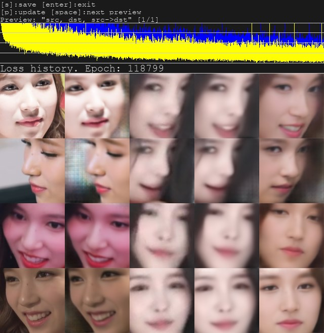
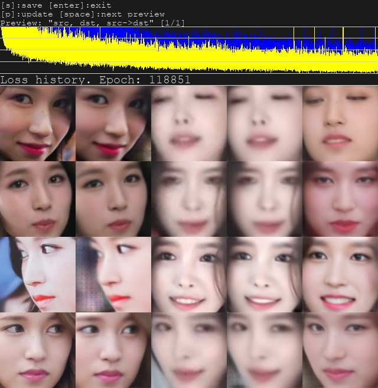
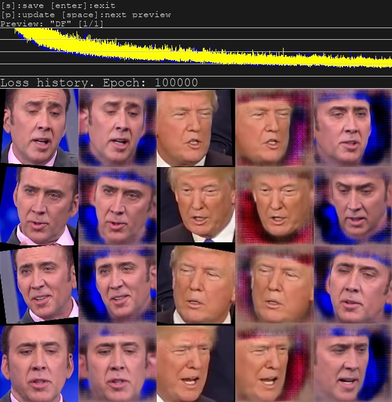
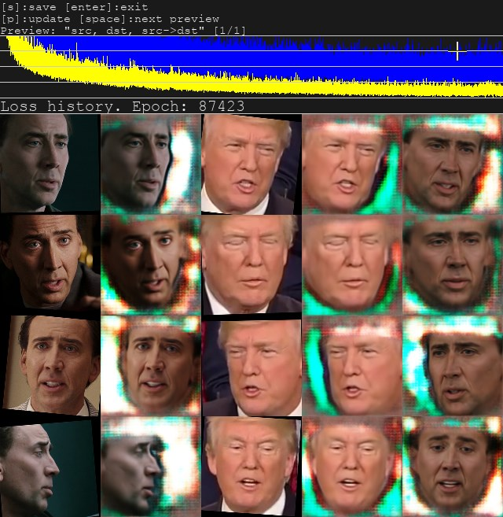
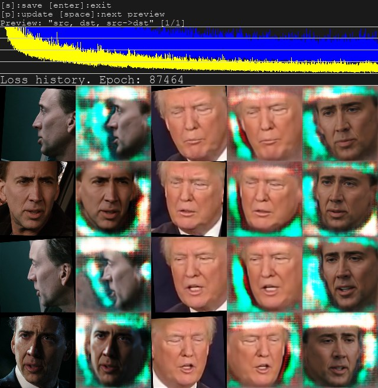
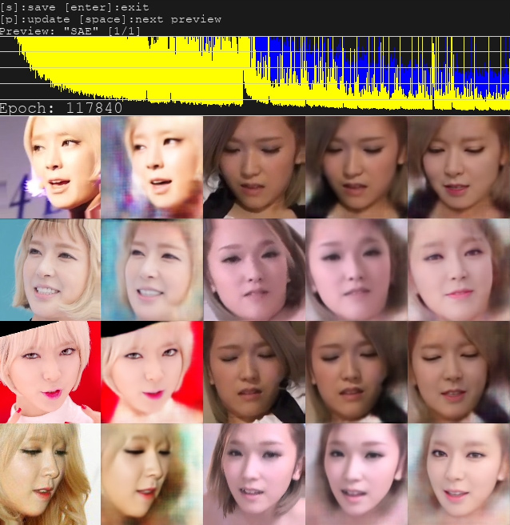
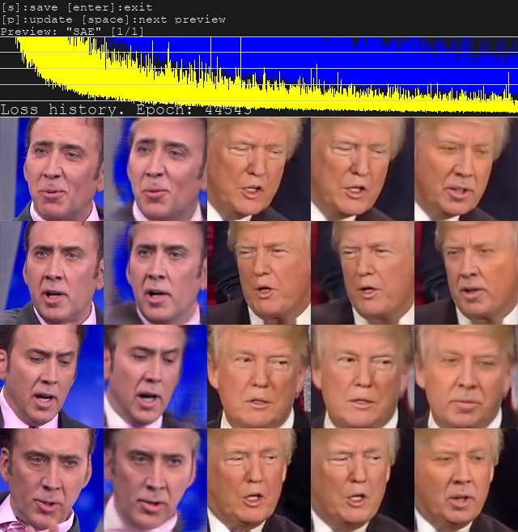
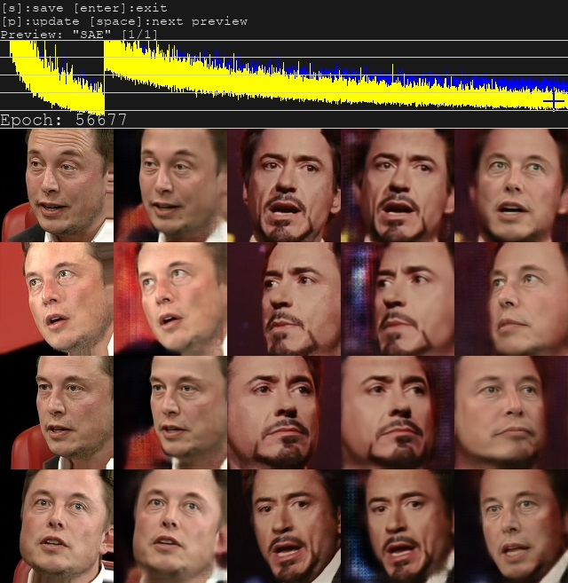
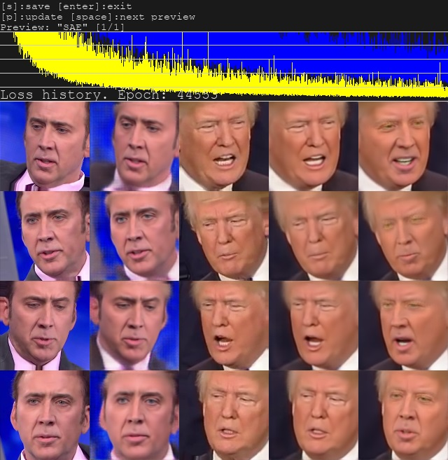
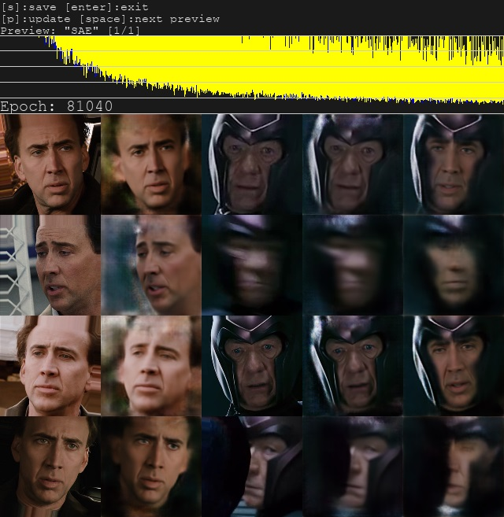

- **H64 (2GB+)** - half face with 64 resolution. It is as original FakeApp or FaceSwap, but with new TensorFlow 1.8 DSSIM Loss func and separated mask decoder + better ConverterMasked. for 2GB and 3GB VRAM model works in reduced mode.

H64 Robert Downey Jr.:

- **H128 (3GB+)** - as H64, but in 128 resolution. Better face details. for 3GB and 4GB VRAM model works in reduced mode.

H128 Cage:

H128 asian face on blurry target:

- **DF (5GB+)** - @dfaker model. As H128, but fullface model. Strongly recommended not to mix various light conditions in src faces.

- **LIAEF128 (5GB+)** - Less agressive Improved Autoencoder Fullface 128 model. Result of combining DF, IAE, + experiments. Model tries to morph src face to dst, while keeping facial features of src face, but less agressive morphing. Model has problems with closed eyes recognizing.

LIAEF128 Cage:

- **SAE ( minimum 2GB+, recommended 11GB+ )** - Styled AutoEncoder - new superior model based on style loss. SAE is very flexible model, contains all other models, by default works as stylizer/morpher and does not guarantee that predicted face will look as src, but you can disable styling values to work as classic model. SAE is better than classic models due to multiscale decoder and smooth transition from DSSIM to MSE(pixel) loss. Face obstructions can be reconstructed without any masks. Converter mode 'overlay' should be used if styling enabled. Model has several options on start for fine tuning to fit your GPU. For more info read tips below.

SAE model Cage-Trump video: https://www.youtube.com/watch?v=2R_aqHBClUQ

SAE model Elon Musk - Robert Downey jr video: https://www.youtube.com/watch?v=OLWFnPwzgEY

Scene with extremely obstructed face in helmet, that cannot be handled by any other classic faceswap model (how to train it read tips):

