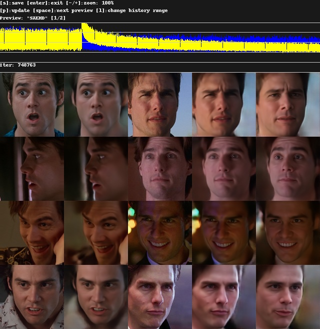
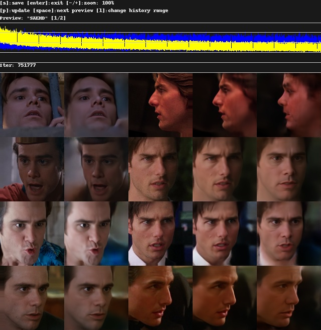

# Background Power option

Allows you to train the model to include the background, which may help with areas around the mask.
Unlike **Background Style Power**, this does not use any additional VRAM, and does not require lowering the batch size.

- [DESCRIPTION](#description)
- [USAGE](#usage)
- [DIFFERENCE WITH BACKGROUND STYLE POWER](#difference-with-background-style-power)

*Examples trained with background power `0.3`:*

## DESCRIPTION

Applies the same loss calculation used for the area *inside* the mask, to the area *outside* the mask, multiplied with
the chosen background power value.

E.g. (simplified): Source Loss = Masked area image difference + Background Power * Non-masked area image difference

## USAGE

`[0.0] Background power ( 0.0..1.0 ?:help ) : 0.3`

## DIFFERENCE WITH BACKGROUND STYLE POWER

**Background Style Power** applies a loss to the source by comparing the background of the dest to that of the
predicted src/dest (5th column). This operation requires additional VRAM, due to the face that the predicted src/dest
outputs are not normally used in training (other then being viewable in the preview window).

**Background Power** does *not* use the src/dest images whatsoever, instead comparing the background of the predicted
source to that of the original source, and the same for the background of the dest images.
