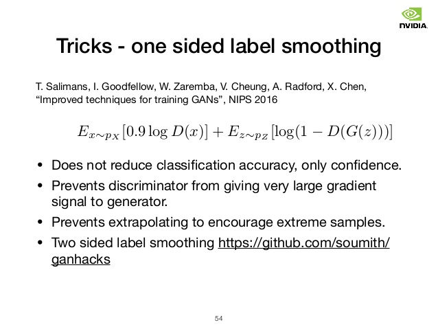

# GAN Options

Allows you to use one-sided label smoothing and noisy labels when training the discriminator.

- [ONE-SIDED LABEL SMOOTHING](#one-sided-label-smoothing)
- [NOISY LABELS](#noisy-labels)

## ONE-SIDED LABEL SMOOTHING



> Deep networks may suffer from overconfidence. For example, it uses very few features to classify an object. To 
> mitigate the problem, deep learning uses regulation and dropout to avoid overconfidence. 
> 
> In GAN, if the discriminator depends on a small set of features to detect real images, the generator may just produce 
> these features only to exploit the discriminator. The optimization may turn too greedy and produces no long term 
> benefit. In GAN, overconfidence hurts badly. To avoid the problem, we penalize the discriminator when the prediction 
> for any real images go beyond 0.9 (D(real image)>0.9). This is done by setting our target label value to be 0.9 
> instead of 1.0.
 - [GAN — Ways to improve GAN performance](https://towardsdatascience.com/gan-ways-to-improve-gan-performance-acf37f9f59b)

By setting the label smoothing value to any value > 0, the target label value used with the discriminator will be:
```
target label value = 1 - (label smoothing value)
```
### USAGE

```
[0.1] GAN label smoothing ( 0 - 0.5 ?:help ) : 0.1
```

## NOISY LABELS

> make the labels the noisy for the discriminator: occasionally flip the labels when training the discriminator
 - [How to Train a GAN? Tips and tricks to make GANs work](https://github.com/soumith/ganhacks/blob/master/README.md#6-use-soft-and-noisy-labels)

By setting the noisy labels value to any value > 0, then the target labels used with the discriminator will be flipped
("fake" => "real" / "real" => "fake") with probability p (where p is the noisy label value).

E.g., if the value is 0.05, then ~5% of the labels will be flipped when training the discriminator

### USAGE
```
[0.05] GAN noisy labels ( 0 - 0.5 ?:help ) : 0.05
```


