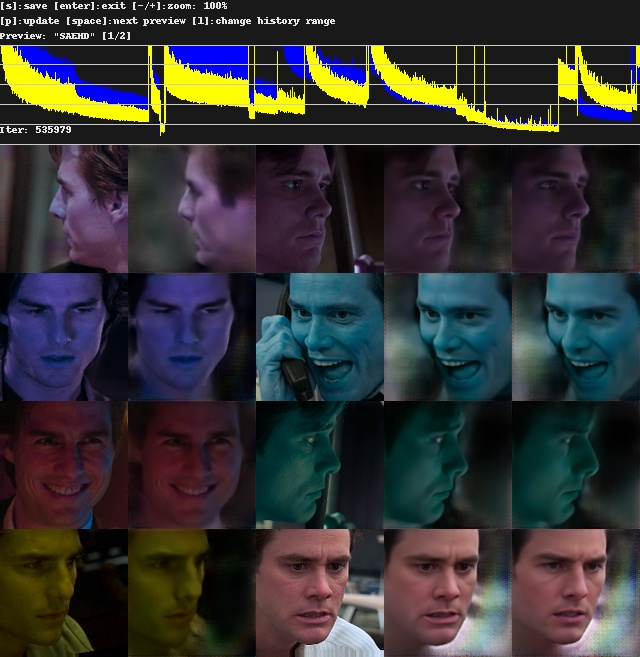

# Random Color option

Helps train the model to generalize perceptual color and lightness, and improves color transfer between src and dst.

- [DESCRIPTION](#description)
- [USAGE](#usage)



## DESCRIPTION

Converts images to [CIE L\*a\*b* colorspace](https://en.wikipedia.org/wiki/CIELAB_color_space),
and then randomly rotates around the `L*` axis. While the perceptual lightness stays constant, only the `a*` and `b*`
color channels are modified. After rotation, converts back to BGR (blue/green/red) colorspace.

If visualized using the [CIE L\*a\*b* cylindical model](https://en.wikipedia.org/wiki/CIELAB_color_space#Cylindrical_model),
this is a random rotation of `h°` (hue angle, angle of the hue in the CIELAB color wheel),
maintaining the same `C*` (chroma, relative saturation).

## USAGE

```
[n] Random color ( y/n ?:help ) : y
```

