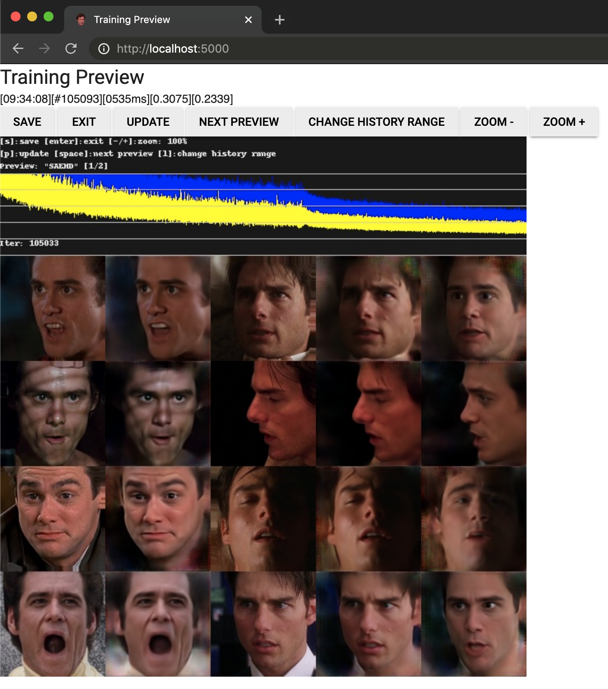

# Web UI

View and interact with the training preview window with your web browser.
Allows you to view and control the preview remotely, and train on headless machines.

- [INSTALLATION](#installation)
- [DESCRIPTION](#description)
- [USAGE](#usage)
- [SSH PORT FORWARDING](#ssh-port-forwarding)



## INSTALLATION

Requires additional Python dependencies to be installed: 
- [Flask](https://palletsprojects.com/p/flask/), 
  version [1.1.1](https://pypi.org/project/Flask/1.1.1/)
- [Flask-SocketIO](https://github.com/miguelgrinberg/Flask-SocketIO/), 
  version [4.2.1](https://pypi.org/project/Flask-SocketIO/4.2.1/)

```
pip install Flask==1.1.1
pip install Flask-SocketIO==4.2.1
```  

## DESCRIPTION

Launches a Flask web application which sends commands to the training thread 
(save/exit/fetch new preview, etc.), and displays live updates for the log output
e.g.: `[09:50:53][#106913][0503ms][0.3109][0.2476]`, and updates the graph/preview image.

## USAGE

Enable the Web UI by appending `--flask-preview` to the `train` command.
Once training begins, Web UI will start, and can be accessed at http://localhost:5000/

## SSH PORT FORWARDING

When running on a remote/headless box, view the Web UI in your local browser simply by
adding the ssh option `-L 5000:localhost:5000`. Once connected, the Web UI can be viewed 
locally at http://localhost:5000/

Several Android/iOS SSH apps (such as [JuiceSSH](https://juicessh.com/)
exist which support port forwarding, allowing you to interact with the preview pane
from anywhere with your phone.
